# PepisCMS

[](https://travis-ci.org/piotrpolak/pepiscms)
[](https://codeclimate.com/github/piotrpolak/pepiscms/maintainability)

PepisCMS is a content management system. Its main feature is the [CRUD module generator](#generating-a-crud-module)
which makes it easy to set up an entire administration panel based on the database schema definition within minutes.
The generated administration panel consists of [modules](#modules) that can be further customized (or just left as they
are if you don't care about the presentation details).

The application is designed as a core library on top of the [CodeIgniter framework](https://codeigniter.com/) and it
allows to be swapped/upgraded with no or minimal changes in the project code.

* [Features](#features)
* [Live-demo](#live-demo)
* [Requirements](#requirements)
* [Installation](#installation)
* [Modules](#modules)
* [Generating a CRUD module](#generating-a-crud-module)
* [Built-in utilities](#built-in-utilities)
* [Security policy](#security-policy)
* [Deployment configurations](#deployment-configurations)
* [Simplified domain model](#simplified-domain-model)
* [Architecture overview](#architecture-overview)
* Core libraries:
    * [Generic model](#generic-model)
    * [FormBuilder](#formbuilder-library)
    * [DataGrid](#datagrid-library)
    * [CrudDefinitionBuilder](#cruddefinitionbuilder)
    * [ContainerAware](#containeraware)
* [Application helpers](#application-helpers)
* [Breaking API changes and upgrade instructions](CHANGES.md)
* [Benchmarking](#benchmarking)
* [Naming convention inconsistency](docs/NAMING_CONVENTION_INCONSISTENCY.md)
* [Changes comparing to CodeIgniter](#changes-comparing-to-codeigniter)
* [Enabling library and models autocomplete predictions](#enabling-library-and-models-autocomplete-prediction)
* [Useful commands](docs/USEFUL_COMMANDS.md)
* [Optional Libraries](#optional-libraries)


## Live demo

The demo application is automatically deployed to Heroku and can be reached at:

* [https://pepiscms-demo.herokuapp.com/](https://pepiscms-demo.herokuapp.com/)

The sources for the demo application can be found at [https://github.com/piotrpolak/pepiscms-demo](https://github.com/piotrpolak/pepiscms-demo).

*Please note that the contents of the demo deployment are automatically cleaned up each time a new version is deployed.*


## Some history

PepisCMS was started in 2007 as a coursework project. Shortly after the first release the system was serving several
production websites and CRM systems.

[CodeIgniter](https://codeigniter.com/) was picked as the application framework, back then there were few serious
PHP frameworks available and CodeIgniter was a reasonable choice.

During its lifespan, PepisCMS has been fluently ported from version CI 1.5.4 to 3.1+. One should be aware that using
a *pre-PSR* framework implies that all the implementation is tightly coupled to the framework libraries.

As 2018, the project is **fully functional** and **well tested**. Some automatic tests were added as well (PHPUnit for
core components and Behat for smoke tests). Due to the minimal footprint and literally no overhead of the framework,
project built on top of PepisCMS are really fast.

As PepisCMS 1.0.0 the support for composer dependency management has been implemented.
Additionally some of the code has been rewritten in the PSR style and benefits from PSR class autoloading.
Version 1.0.0 plays well both with PHP5 and PHP7.

*There are no plans to migrate PepisCMS to CodeIgniter 4 - it is not about the efforts - CI4 is rather a new
framework than just an upgrade.*


## Development philosophy

The project has been developed using a very conservative approach and manually tested on multiple deployments prior
to releasing a stable version. This made it possible to keep regression to minimum but in time.


### Becoming an open source project

On the "10th birthday" the project was released as open source under the [MIT license](LICENSE.txt).

Prior to pushing the project to github its code has been slightly refactored, cleaned up from any proprietary code,
described by some tests and released as a composer dependency.

Being a composer module PepisCMS now benefits from the component management. Upgrading any of its dependencies is now
simplified to incrementing composer versions.

All of the above makes it easy to provide hot fixes and components' updates thus it extends the expected lifespan of the
product.


## Features


* **Modularity**

    Modularity and consistency. An external modules can be written independent on the system core.
    System core can be upgraded without any modification in the current application at any time.
  
    There are two kinds of modules - builtin (available in all projects) and user-space modules.
    Modules can be enabled or disabled from the administration console.
    A typical module consists from both admin and public controllers + the support code.
    
    Read more about [modules](#modules).
  
* **Advanced user and user right management**

    The user is granted a certain right above a business entity.
    Every single controller method has associated a minimal right above a certain entity.
    
    All violations of security policy are reported in system audit logs.
    
    You can create as many users as you want, you can assign a user to several groups, the security policy can
    be modified at runtime.
    
    Read more about [security policy](#security-policy).
  
* **Audit logs**
  
    All user actions and unexpected application behaviors can be tracked down using an advanced log utility.
    PepisCMS provides a logging API and a console for analyzing system logs.
  
* **User session security**

    User session will expire after one hour of inactivity (configurable).
    The session is protected against session spoofing attack by validating the IP each time the system validates
    the user rights.
  
* **Web based file manager**

    The user can manage files on the server using an AJAX file manager.
    You can restrict the allowed upload extension list from configuration.
  
* **Enhanced SMTP Email sender**
  
    A utility for sending emails in a reliable way reliable.
    When the system is unable to connect to the remote SMTP server, an alternative `mail` gateway is used
    and the fallback action is reported in audit logs.
  
* **Multi language native support** 

    The application supports internationalization and multi language support by default, both for front-end and backend.
    An integrated [translator](#translator) speeds up multi language application development.
  
* **Rich Text Editor**

    [CKEditor](https://ckeditor.com/) makes you you feel you are using MS Word while editing web site contents.
    You can change text formatting and attach pictures.

* **Configuration tests on startup**

    Basic configuration tests ensure system cohesion and proper operation on any environment.
  
* **Two level cache mechanism**

    Makes your web site bulletproof. The HTML output cache mechanism is run before the framework is initialized and
    serves static contents at the speed of serving static pages.
  
* **Backup utility**

    Create and restore web site contents from XML backup, create SQL dumps.
  
* **Intranet options**

    You can restrict access to public contents and uploaded files for unauthenticated users.
  
* **SEO Friendly**

    PepisCMS generates SEO friendly links and optimized meta tags. It also automatically generates sitemap
    (both txt and xml) for the website.
  
* **Build-in components for generating grids and forms.**
  
    Using these components you have 90% of requested features implemented from the start.
    The [data grid](#datagrid-library) supports ordering table by any column and implements multiple filters.
    The [form generator](#formbuilder-library) implements validation, data retrieval and data save,
    file upload and many others by default.
    
    You can extend or overwrite behavior of these components using [advanced callbacks](#lifecycle-callbacks).
  
* **Build-in helpers for generating Excel files and PDF files.**

    You can easily export application data into XLS file or print any HTML to PDF.
  
* **Content journaling**
 
    Makes it simple to track down changes upon entities and to restore specific values.
  
* **CRUD module generator**

    Generate database CRUD admin panel in minutes.
    
    Read more about [CRUD module generator](#generating-a-crud-module).
    
* **Builtin UI translator**

    Localize your application with no effort.
    
    Read more about [Translator module](#translator).
  
* **Builtin SQL console**
  
    Makes maintenance and upgrade tasks a piece of cake.
    
    Read more about [SQL Console module](#sql-console).

* **Seamless Symfony2 integration**
 
    Consume Symfony2 encapsulated business logic inside CMS panel. Benefit from the powerful dependency injection
    engine.
  
* **Admin panel customization**

    Makes it possible to customize the look of administration panel by offering the possibility of injecting
    HTML/JS/CSS code in selected sections of the view.
  
* **Backward compatibility**

    Any instance of PepisCMS can be easily upgraded to a newer version with minimal effort.
    All versions within the same branch are 100% backward compatible.
  
* **Cache and admin panel speed**

    Critical components of administration panel are cached thus improving overall performance of CMS.
  
* **Twig integration**

* **SSH and Array models**

    Makes it possible to operate on models that provide data out of any source.
  
* **Google Chart integration**

* **phpCAS/native authentication drivers**

    *phpCAS authentication driver is disabled by default.*


# Requirements

* PHP 5.6+ with mysqli, gd (recommended), mbstring (recommended)
* Apache 2 with mod_rewrite
* MySQL or MariaDB database
* composer


## Installation

PepisCMS is installed as a composer dependency and then instantiated in the user directory.

Once the composer dependency has been configured and downloaded (see below) there are two ways of bootstrapping
PepisCMS instance:
* [attended](#attended-user-installation) (user)
* [unattended](#unattended-installation) (manual)

### Configuring composer

# Adding composer dependency from command line ()

```bash
composer require piotrpolak/pepiscms --prefer-dist
```

# Configuring composer from command line (using dev-master from Github repository)

```bash
composer init --type "project" --stability "dev" \
    --repository '{"type": "vcs", "url": "https://github.com/piotrpolak/pepiscms.git"}' && \
    composer require piotrpolak/pepiscms dev-master --prefer-dist
```

# Creating composer.json by hand (using dev-master from Github repository)
                                                                 
```json
{
    "name": "yourvendorname/yourprojectname",
    "minimum-stability": "dev",
    "repositories": [
        {
            "type": "vcs",
            "url": "https://github.com/piotrpolak/pepiscms.git"
        }
    ],
    "require": {
        "piotrpolak/pepiscms": "dev-master"
    }
}

```

### Attended (user) installation
    
1. Install composer dependencies

    ```bash
    composer install --prefer-dist
    ```
    
2. Copy `install.php` file to root directory

     ```bash
     cp ./vendor/piotrpolak/pepiscms/install.php ./
     ```
     
3. Open `install.php` in your browser [http://localhost/install.php](http://localhost/install.php)

    This will create a basic framework structure. Please follow the installation guide.

    * Directory view
        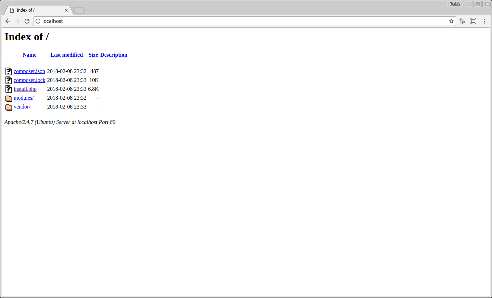
   
    * Copy files and create framework structure
        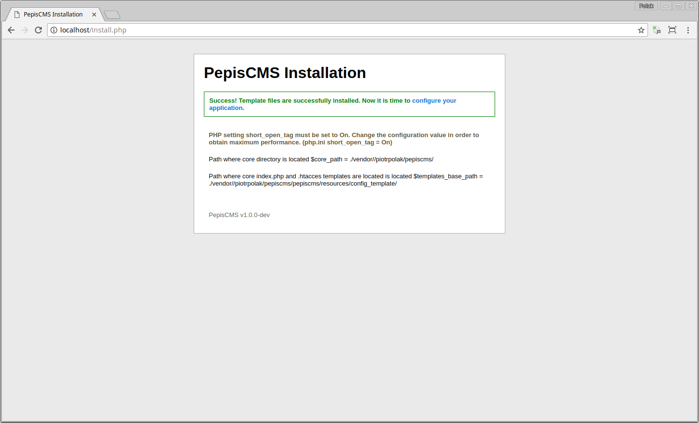
   
    * Database connection setup
        
        There are two options: **native** and **Symfony import**.
         
        When selecting **native** you will be asked for database host, name, user and password.
        
        If selecting **Symfony import** then PepisCMS tries to automatically parses Symfony `parameters.yml` configuration.
    
        
   
    * Selecting authorization driver. You can choose from **native** (users are managed locally) or **CAS**
    
        When selecting **CAS** then user passwords **will not be managed by PepisCMS**. The local users having minimal 
        access rights will be created upon the first user authentication (use of the system).
        
        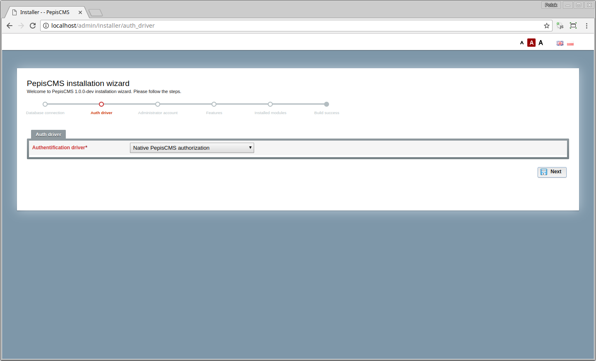
   
    * Configuring administrator account
        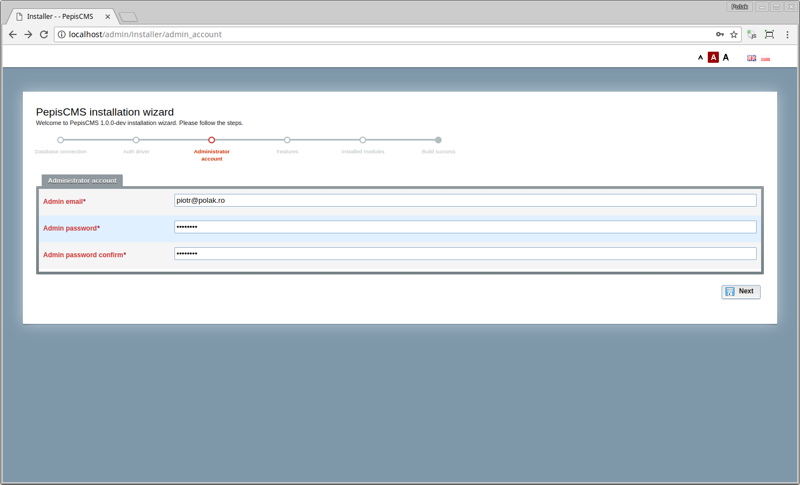
   
    * Configuring site options
        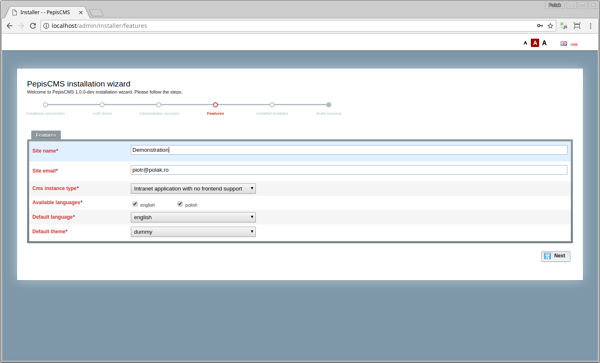
   
    * Configuring installed modules
    
        You can choose which modules to be installed and add specified modules to menu and/or utilities.
        
        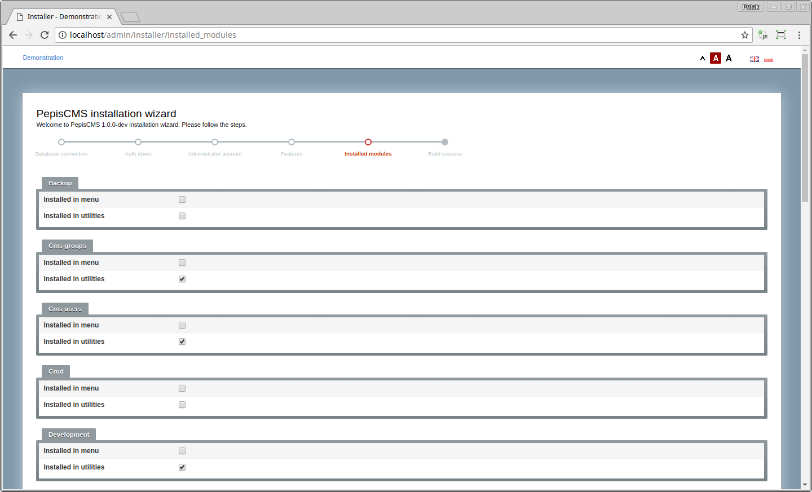
   
    * Success message
        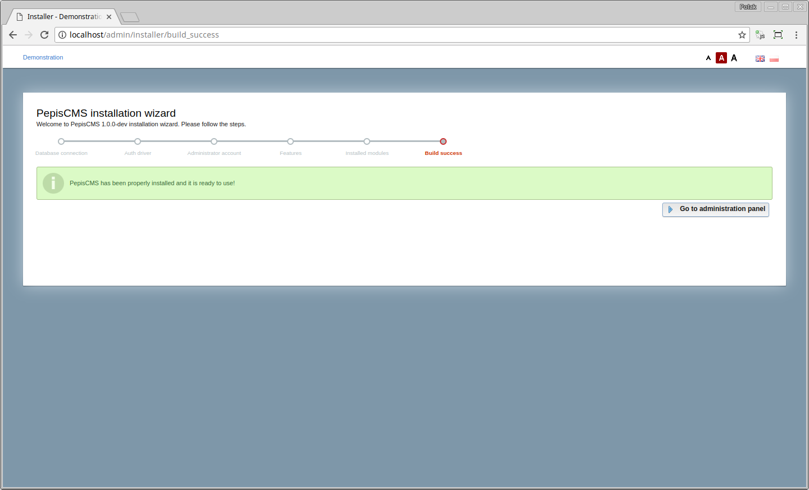
   
    * Dashboard
        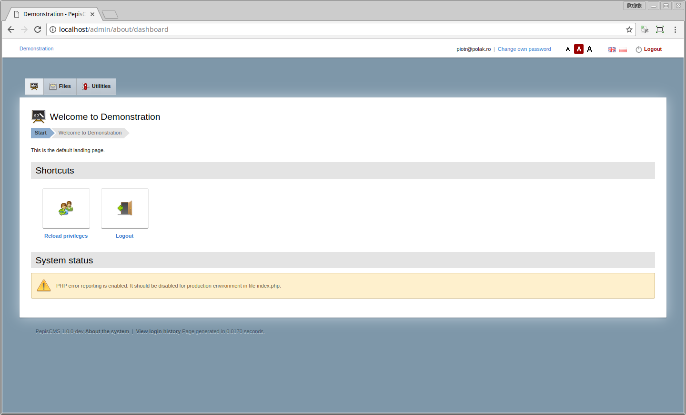
    
### Unattended installation

PepisCMS can be installed and configured in an unattended way.

The following BASH variables can be used to control the installation parameters:

```bash
# The variable values are empty by default. The below values are taken from docker-compose.yml file
PEPIS_CMS_DATABASE_CONFIG_TYPE=native
PEPIS_CMS_DATABASE_HOSTNAME=db
PEPIS_CMS_DATABASE_USERNAME=pepiscms
PEPIS_CMS_DATABASE_PASSWORD=pepiscms
PEPIS_CMS_DATABASE_DATABASE=pepiscms
PEPIS_CMS_AUTH_DRIVER=native
PEPIS_CMS_AUTH_EMAIL=piotr@polak.ro
PEPIS_CMS_AUTH_PASSWORD=demodemo
PEPIS_CMS_SITE_EMAIL=piotr@polak.ro
PEPIS_CMS_SITE_NAME=Demonstration
```

The command line for unattended installation:

```bash
composer install --prefer-dist && \
    cp vendor/piotrpolak/pepiscms/pepiscms/resources/config_template/template_index.php ./index.php && \
    sed -i -e 's/TEMPLATE_VENDOR_PATH/\.\/vendor\//g' ./index.php && \
    cp vendor/piotrpolak/pepiscms/pepiscms/resources/config_template/template_.htaccess ./.htaccess && \
    php index.php tools install && \
    php index.php tools register_admin $PEPIS_CMS_AUTH_EMAIL $PEPIS_CMS_AUTH_PASSWORD
```

See [demo application setup scripts](https://github.com/piotrpolak/pepiscms-demo/blob/master/bin/setup.sh) to see PepisCMS unattended
installation in action.


## Modules

PepisCMS distinguishes between two types of modules, based on where the modules code is placed:

* **system modules** - these modules are bundled in the system and are upgraded each time PepisCMS is upgraded,
    those modules are available for all PepisCMS applications. See the list of [built-in modules](#built-in-modules) or
    check the [modules source](./pepiscms/modules).
* **user modules** - user space modules, those are specific to instance of your application.

By default all modules are disabled and must be manually enabled (installed) (during PepisCMS installation or at any later point).

### Module installation

Module installation consists in enabling the module and configuring its parameters (if available). Modules that do have
administration interface can be attached to an admin panel menu and/or utilities dashboard. Most modules come with
predefined configuration and presentation defaults. Configuration options and presentation details are defined in a
module descriptor (a class that implements [ModuleDescriptableInterface](./pepiscms/application/classes/ModuleDescriptableInterface.php)).

An SQL code can be executed upon module installation/uninstallation. A file containing SQL code can be optionally
specified in module descriptor.

To view installed modules please navigate to `Start > Utilities > Installed modules`.

### Accessing modules in the browser

#### Admin module actions

```bash
http://localhost/admin/<modulename>/<action>
```

#### Public module actions

```bash
http://localhost/<modulename>/<action>
```

Where `<modulename>` is the module name (directory name) and `<action>` is the method name
(the method must have public classifier).

If no action is specified, the default action is `index`, i.e. `http://localhost/<modulename>` is equal to
`http://localhost/<modulename>/index`

Please note that the module must be installed and the `Frontend support (pages and modules)` must be enabled in order
to access public controllers. This can be enabled from `Start > Utilities > Site's configuration`.

### Module structure

* Module descriptor (optional, when specified must implement [ModuleDescriptableInterface](./pepiscms/application/classes/ModuleDescriptableInterface.php))
* Admin controller (optional)
* Public controller (optional)
* Admin views (optional)
* Public views (optional)
* Models (optional)
* Libraries (optional)
* Language files
* Security policy (`security_policy.xml`)
* Additional resources (like default icons: `<module_name>/resources/icon_16.png` and `<module_name>/resources/icon_32.png`)

#### Sample module structure

Below the structure of sample `labels` module:

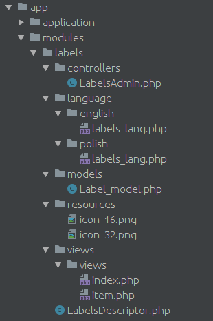

There is also a legacy module structure layout. The legacy layout is no longer supported by default, however it can be
enabled from configuration in case you already have modules generated with a past version of PepisCMS and do not want
to upgrade:


### Built-in modules

#### Groups

A utility for managing user groups and groups access rights.

Read more about [security policy](#security-policy).

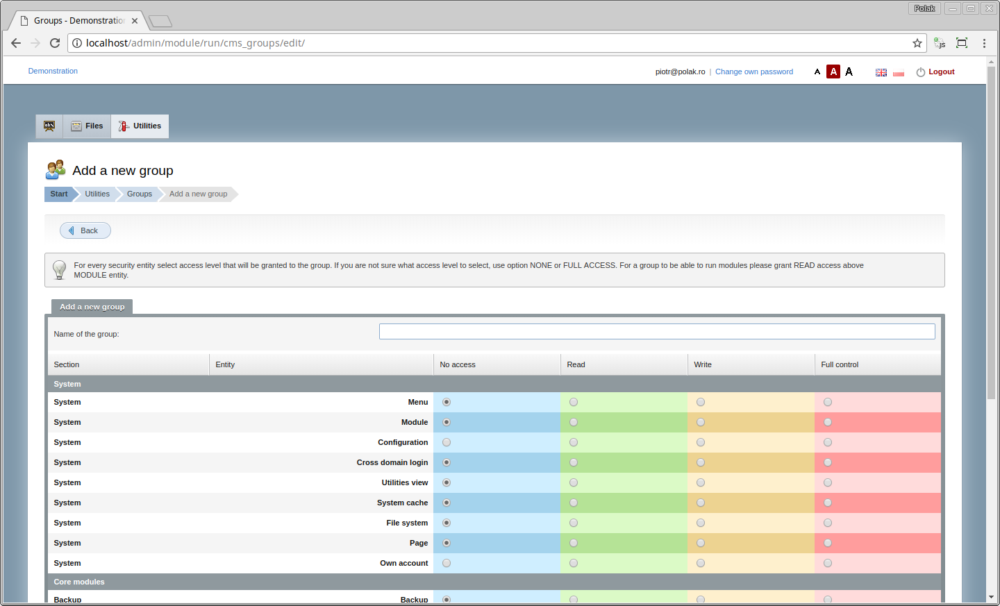

#### User accounts

A utility for managing and registering new users.


#### Development tools

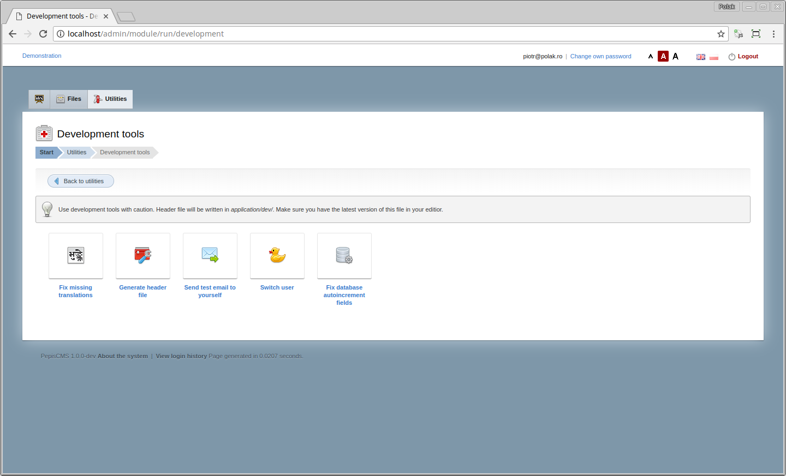

#### System logs

All user actions and unexpected application behaviors can be tracked using an advanced log utility.

PepisCMS provides a logging API and a console for analyzing system logs.

Every single log consists of the following entry:
* **Timestamp** of the event
* **User ID/email** generating the event
* **IP address** of the user creating the entry
* **Modul ename** (if case)
* **Collection name** – abstract label used for grouping the events and drawing statistics
* **Debug message**
* **URL** where the event occurred
* **Severity** of the event –info, notice, warning, error


#### SQL console

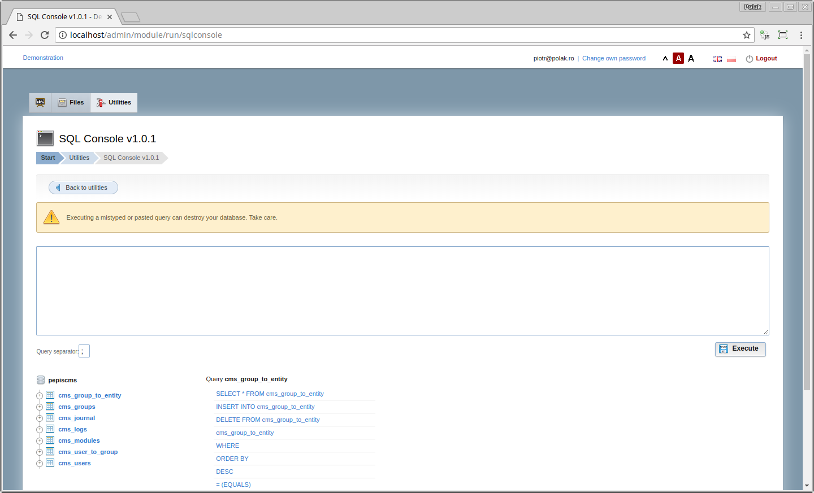

#### System information

Displays system information, paths, versions, storage occupied.

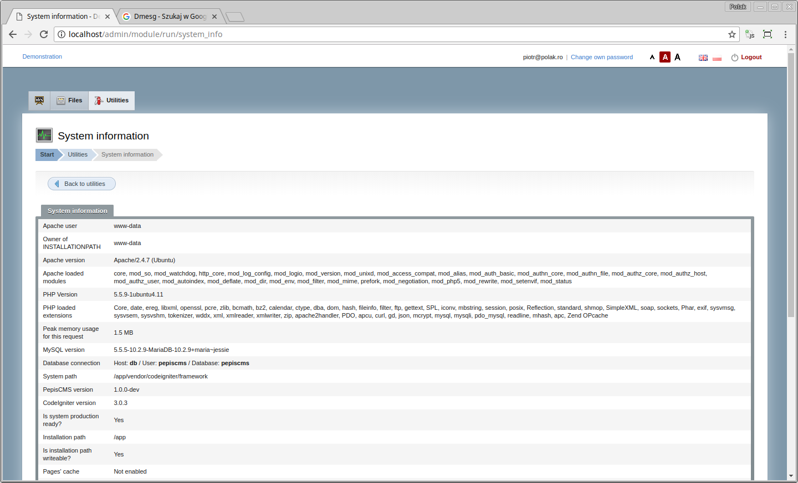

#### Translator

A utility for translating user interface.

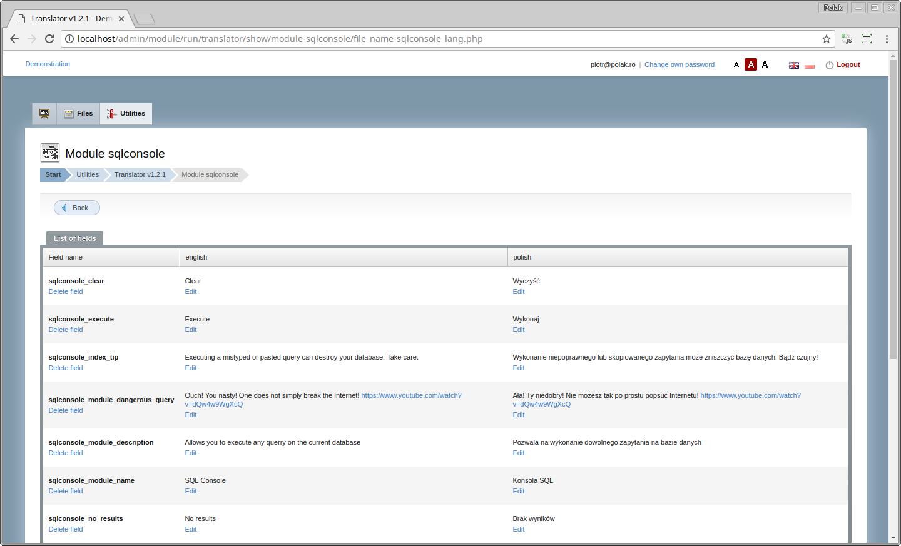

#### Symfony2 bridge

Allows to invalidate Symfony cache and to view Symfony logs.

Symfony2 bridge must be first enabled by [adding an piotrpolak/codeigniter-symfony2-bridge library](#enabling-symfony-bridge).
See the [codeigniter-symfony2-bridge project](https://github.com/piotrpolak/codeigniter-symfony2-bridge).

#### Backup

Allows to export/import pages structure to/from XML.

Pages feature must be enabled to use this module.

#### CRUD

This module is a base for any other CRUD module. It is not installable.

#### Dmesg

Displays system dmesg.

#### HTML customization for admin panel

Allows to inject HTML snippets to admin panel header and footer.


## Generating a CRUD module

CRUD stands for *Create Read Update and Delete*. PepisCMS aims to ease creating typical CRUD modules for managing data
saved in a database table.

To generate a CRUD module for a given database table:

1. Execute SQL DDL against the database. You can use the bundled [SQL console module](#sql-console).
2. Make sure [development tools module](#development-tools) is installed.
2. Navigate to `Start > Utilities > Development tools > Build a new module`.
3. Provide mandatory `database table name` and optional module details:

    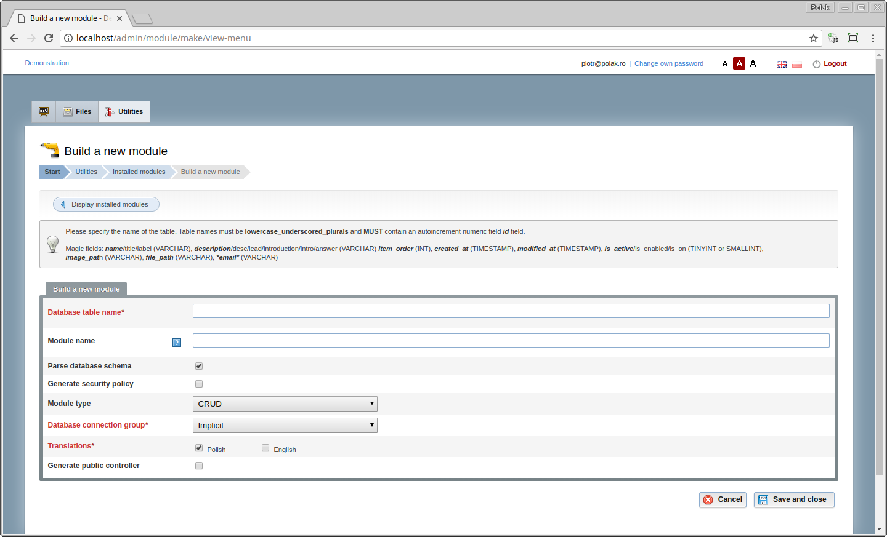
    * Module name - leave empty to keep default name equal to the database table name
    * Whether to parse database schema
    * Whether to generate implicit security policy
    * Module type (CRUD or Default/basic)
    * Database connection (if you have multiple databases configured)
    * Languages for generating translation files
    * Whether to generate a public controller
    
4. Proceed
5. Customize translations (optionally)
6. Customize generated controller code (optionally)
7. Upload custom icons (optionally)

You can find a sample SQL file to play with at [sql/sample.sql](sql/sample.sql).


## Built-in utilities

* Site's configuration
* Modules management
* Cache management/flush
* Reload (own) privileges
* Security policy builder
* Check own access rights utility
* Configuration tests


## Security policy

A security policy is a set of required user rights above certain entities required to access a controller's method.
The user is granted one of the four access rights above above the defined entities.

When a security policy is created, the administrator first defines desired entities (such as `page`, `user`, `group`, `configuration` etc.)
and assigns the entities to methods of controllers.

How access check works:
1. User accesses a controller method
2. If the user is marked as root, the access is immediately granted
3. SecurityManager parses appropriate `security_policy.xml` and reads the entity and minimum access level for a given
    controller method
4. SecurityManager checks groups for the authenticated user and computes associated entity-granted access map
5. SecurityManager checks if the computed user entity-granted access map contains an entry related to the entity
6. SecurityManager checks the user access level against the minimum required access level, if it is satisfied or if
    the required access level is `NONE` the user is granted access to the controller method.
    Otherwise the user is denied access.
    
**All violations of security policy are reported using system logs.**

### Possible access levels

There are four access levels:

* `NONE`
* `READ`
* `WRITE`
* `ALL`

### Entities

An entity is just a string representing the core business object.

**Example**: Managing, rearranging, managing, and running modules is realised by different method of the
`module` controller. Each method has different minimal access levels for `module` entity:

```xml
<?xml version="1.0" encoding="UTF-8"?>
<security_policy generated_at="2018-04-18 23:18:56" version="1.1">
  <policy module="system">
  
    <!-- ... -->
    
    <controller name="module">
      <method name="index">
        <entity name="module" access="READ"/>
      </method>
    </controller>
    <controller name="module">
      <method name="move">
        <entity name="module" access="WRITE"/>
      </method>
    </controller>
    <controller name="module">
      <method name="setup">
        <entity name="module" access="FULL_CONTROL"/>
      </method>
    </controller>
    <controller name="module">
      <method name="do_setup">
        <entity name="module" access="FULL_CONTROL"/>
      </method>
    </controller>
    <controller name="module">
      <method name="uninstall">
        <entity name="module" access="FULL_CONTROL"/>
      </method>
    </controller>
    <controller name="module">
      <method name="run">
        <entity name="module" access="READ"/>
      </method>
    </controller>
    
    <!-- ... -->
    
  </policy>
</security_policy>
```

Security policy management console view:
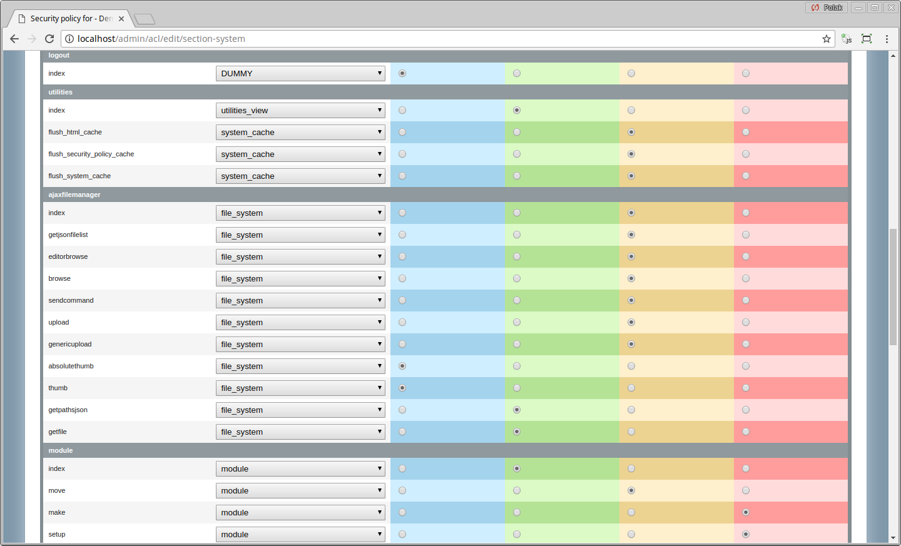

Also see [groups module](#groups).

### Controllers, methods and reflection

Every controller method for which a security policy is defined has associated a minimal required access right above an
entity.

The reflection mechanism is used to scan for the controller methods.

### Changing security policy at runtime

Security policy can be changed at any time without need to change code or recompile anything.
`AdminControllers` initializes `SecurityManager` that handles security transparently to the programmer or user of the
system.

### Marshaling a security policy and caching

Security policy is serialized onto XML file (`security_policy.xml`) that is platform independent and can be manually edited.
In order to reduce time needed for parsing XML file with each request, the security policy is storied in a processed and
serialized cached format on the permanent storage or directly in the memory.

### Types of security policies

There are two types of security policy:

* System core security policy ([core security_policy.xml](./pepiscms/application/security_policy.xml))
* Module security policy (example, [user accounts module security_policy.xml](./pepiscms/modules/cms_users/security_policy.xml).)

### User groups 

Once the security policy is created for both core and modules the administrator can create user groups.
Creating a group is process similar to building security policy - the administrator picks an access level for every
single entity that is granted to anyone who belongs to the group.

A single user can belong to any number of user groups. This offers high flexibility because you can manage the groups
separately.


## Deployment configurations

A project can be deployed in several configurations. The following options will be presented in the small-to-enerprise
order. 

### Small website (Content Management System, Web)

The framework is installed as the core only and provides basic functions for building a website that can use multiple
template; there is a SEO friendly frontend and simple administration panel for managing pages, menu, files and administrators. 

### Administration panel for a database (Intranet Application) 

In this option the framework acts as a basic database application that can be accessed from various locations.

The framework can manage several databases of different types at the same time. There is no public frontend available. 

*Example*: Invoicing application 

### Portal/eCommerce application (Content Management System, Web)

Portal combines the features of a small website and an intranet application. Some pages of the portal are generated
dynamically; there can be some kind of interaction between the platform and the visitor (comments, user login, order
processing etc.). Administrator of such applications has some extra features and dedicated modules available. 

All of the components including business logic are placed on the same machine.

*Advantages*: simple to implement, low cost

*Disadvantages*: any failure can be deadly, can have scalability issues 

*Example*: blog, online shop.


## Architecture overview

### Core of the system

Core implements most of the base features and it is supposed to be stable over the time.
The core takes advantage of [CodeIgniter framework](https://codeigniter.com/) that provides basic architecture,
input security and database ActiveRecord access method.

Specifically for the core of PepisCMS some of the classes were overloaded or rewritten
(see [overwritten core libraries](./pepiscms/application/core/).

PepisCMS distinguishes between 4 types of controllers:

* **Basic controller** (same as for CodeIgniter)
* **[ModuleController](./pepiscms/application/classes/ModuleController.php)** - public module
    controller
* **[AdminController](./pepiscms/application/classes/AdminController.php)** - for core administration
    panel, handles security check transparently
* **[ModuleAdminController](./pepiscms/application/classes/ModuleAdminController.php)** - module
    administration panel controller that supports "hotplug" and a kind of visualization where the original
    AdminController acts as a host and maps all accessible resources (translates) to ModuleAdminController instance
    without duplicating them in memory

### Modules

Modules implement business specific features that are not generic and should not be
distributed for all the instances of the application. Modules can be easily transferred from a
project to project and should not create dependency conflicts. Every single module can be
enabled/disabled at any time.

System and user modules they work exactly the same. If an user space module of the same
name as an existing system module is installed, the system module will be completely ignored –
you can overwrite the default users and logs modules.

Read more about [Modules](#modules).

### Model-View-Presenter architectural pattern

The application is built around [Model View Presenter pattern](https://en.wikipedia.org/wiki/Model%E2%80%93view%E2%80%93presenter)).

A request triggers a presenter (controller) method that uses logic encapsulated in models (and libraries) to prepare
data for the view layer.

#### Model 

Model encapsulates data access using the [Data Access Object](https://en.wikipedia.org/wiki/Data_access_object) pattern.

Models provide methods that read, update and delete entities. CodeIgniter uses instances of stdClass to represent entities.

Entities:

* have no methods
* have fields that reflect database structure (query result set structure)

All models must start with a capital letter and must be suffixed with _model. Unlike libraries,
the model instance names are case sensitive (this comes from CodeIgniter engine). 

Read more about [CodeIgniter models](https://www.codeigniter.com/user_guide/general/models.html).

PepisCMS provides some base models that can be extended in order make development simpler:

| Name                                                                            | Description                                                                                                                                                                                                                                                                                                                                                                                                                                                                                                                                                                                 |
|---------------------------------------------------------------------------------|---------------------------------------------------------------------------------------------------------------------------------------------------------------------------------------------------------------------------------------------------------------------------------------------------------------------------------------------------------------------------------------------------------------------------------------------------------------------------------------------------------------------------------------------------------------------------------------------|
| [Generic_model](#generic-model)                                                 | Generic model is the improved version od CodeIgniter model. It implements methods specified by both [EntitableInterface](./pepiscms/application/classes/EntitableInterface.php) and [AdvancedDataFeedableInterface](./pepiscms/application/classes/AdvancedDataFeedableInterface.php) interfaces. In most cases this class should be extended and parametrized in the constructor but it is left as a non-abstract for DataGrid and FormBuilder components that initialize and parametrize Generic_model "on-the-fly" using prototype design pattern. |
| [Array_model](./pepiscms/application/models/Array_model.php) | Provides Generic_model capabilities that can be applied to data sources other than database.                                                                                                                                                                                                                                                                                                                                                                                                                                                                                                |
| [Ssh_model](./pepiscms/application/models/Ssh_model.php)     | Provides Generic_model and Array_model capabilities for data parsed over SSH                                                                                                                                                                                                                                                                                                                                                                                                                                                                                                                |

#### View 

View is used as the presentation layer. It is fully controlled by controller but it can also pull some data provided by
models or libraries initialized by controller. It is a good technique to prepare all the data inside the controller and
to use view only as the "display layer" with absolutely no logic inside - doing so makes it**** much easier to change
the view, for example from pure HTML to JSON format used by JavaScript.

To load a view you should use the `$this->display()` method from the `Enhanced_controller`. It will automatically compute
view's path based on the module name (if any), controller name and method name.

To assign a variable to the view, you should use the `$this->assign('variable-name', 'variable-value`)` method.

#### Controller

Controllers are these components that interpret input, take some decisions and prepare data for the output.
In the case of web applications by input we understand GET/POST variables, Session variables Cookies and several others.
Controller implements some of the logic and pulls data from different locations – database, web services, APIs, sockets etc. 

Controllers take advantage of libraries and models they load, they should not manipulate the database directly but by using models. 

PepisCMS distinguishes 4 types of controllers:

| Name                                                                                                                          | Description                                                                                                         |
|-------------------------------------------------------------------------------------------------------------------------------|---------------------------------------------------------------------------------------------------------------------|
| [EnhancedController](./pepiscms/application/classes/EnhancedController.php) extends Controller (abstract)  | Implements handy methods like assign($name, $variable) that are used in any other type of controllers.              |
| [AdminController](./pepiscms/application/classes/AdminController.php) extends EnhancedController           | Used for administration panel only. Authorization and authentication is implemented in the constructor.             |
| [ModuleAdminController](./pepiscms/application/classes/ModuleAdminController.php) extends AdminController  | Similar to the AdminController, used for back-end controllers of modules.                                           |
| [ModuleController](./pepiscms/application/classes/ModuleController.php) extends EnhancedController         | Used for front-end controllers of modules. Use document library to set page titles and to interact with the system  |


## Generic model

[Generic_model](./pepiscms/application/models/Generic_model.php) is an extended Model that implements
[EntitableInterface](./pepiscms/application/classes/EntitableInterface.php) required by
[FormBuilder](./pepiscms/application/libraries/FormBuilder.php).

The `EntitableInterface` interface specifies the 3 basic methods: `saveById($id, $data)`, `deleteById($id)` and `getById($id)`.
You can implement the `EntitableInterface` class by default but for most of the cases Generic_model with its helper
methods is more than enough – in most situations Generic_model should only be extended. 

Generic_model also implements [AdvancedDataFeedableInterface](./pepiscms/application/classes/AdvancedDataFeedableInterface.php)
interface that is needed by [DataGrid](./pepiscms/application/libraries/DataGrid.php) component.

Methods of the generic model are worth to mention because they are present in all the models used by PepisCMS.

| Method name                                                                                                                   | Description                                                                                                                                                                                                                                                                                                                                                                                                                                 |
|-------------------------------------------------------------------------------------------------------------------------------|---------------------------------------------------------------------------------------------------------------------------------------------------------------------------------------------------------------------------------------------------------------------------------------------------------------------------------------------------------------------------------------------------------------------------------------------|
| `setTable($table)`                                                                                                            | Sets table name on which the model will operate. Table name must be explicitly specified before the model is usable.                                                                                                                                                                                                                                                                                                                        |
| `setIdFieldName($idField)`                                                                                                    | Overwrites the name of the ID field. The default ID field is called id. Specify id field if your database table's id field is non standard (example personal_number).                                                                                                                                                                                                                                                                       |
| `setWhere($where_conditions)`                                                                                                 | Sets where conditions that will be used when obtaining the data for DataGrid. Where conditions should be of the same form as passed to the Database query object. The parameter must be an associative array where the keys specify the field names and the values are the desired values.                                                                                                                                                  |
| `setAcceptedPostFields($fields)`                                                                                              | Sets the list of accepted POST fields' names. The default saveById method accepts only fields that were previously defined as accepted. FormBuilder automatically sets the accepted post fields based on the defined inputs.                                                                                                                                                                                                                |
| `addAcceptedPostField($field)`                                                                                                | Appends accepted POST field. You can specify a single field (string) or a set of extra fields. This method is handy when you need to append the list of accepted fields once the model/form has been defined, for instance in a FormBuilder callback.                                                                                                                                                                                       |
| `applyFilters($db, $filters)`                                                                                                 | Static method that applies filters specified in the DataGrid format upon the specified DB object. This method is very usefull when you write your own getAdvancedFeed method and you want it to be compaible with the filers.                                                                                                                                                                                                               |
| `getById($id, $fields='*')`                                                                                                   | Returns instance of stdObject or FALSE                                                                                                                                                                                                                                                                                                                                                                                                      |
| `deleteById($id)`                                                                                                             | Deletes row by ID                                                                                                                                                                                                                                                                                                                                                                                                                           |
| `saveById($id, $data_array)`                                                                                                  | Saves object in the database. If no $id is set, the object is inserted, when $id is set, the object is updated.  $data_array must be associative array and its keys must be previously registered by setAcceptedPostFields method!                                                                                                                                                                                                          |
| `move($id, $direction, $table=FALSE, $constraint_field_name=FALSE, $item_order_field_name='item_order', $id_field_name='id')` | This method is used to move elements of a list. It is used for changing the order of menu elements in page controller. Dont try to understand how it works, even for the author is looks like magic after some months. The following method takes all the items belonging to the same "group" (all items having the same value of constraint_field), moves the elements (swaps the item_order field) and normalizes the item_order values.  |
| `getDistinctAssoc($column, $table=FALSE, $pairs=FALSE)`                                                                       | Gets distinct values from a table's collumn. If table parameter is not specified, it will take it from the instance $table variable.You can predefine the return array by specifying $pairs.                                                                                                                                                                                                                                                |
| `getAssocPairs($key_collumn_name, $value_collumn_name, $table=FALSE, $imitial_array=FALSE, $possible_keys=FALSE)`             | Get an associative array build with keys found in $key_collumn_name collumn and values found in $value_collumn_name. You can specify the initial array as $imitial_array                                                                                                                                                                                                                                                                    |
| `generateTextId($text_id_field_name=FALSE, $length=FALSE, $prefix=FALSE, $suffix=FALSE, $table=FALSE)`                        | Generates random string ID that is checked for uniqueness. Random string IDs are used as tracking numbers and in other situations where giving the end user an order ID is not desired.                                                                                                                                                                                                                                                     |
| `setDatabase($database_group)`                                                                                                | Sets the database connection to be used by the model, database group must be defined in database config. Since 0.2.2                                                                                                                                                                                                                                                                                                                        |

Sometimes it is not desired to use the default Generic_model methods, for example when you need to obtain minimalistic
data set. [Generic_model](./pepiscms/application/models/Generic_model.php) by default selects all
from your database using the `*` wildcard sign.


## FormBuilder library

A library that can build and handle HTML forms based on the provided definition.
Form builder can render the form using the default layout or you can register an additional renderer.
FormBuilder can either use an instance of [EntitableInterface](./pepiscms/application/classes/EntitableInterface.php) or
a anonymous instance of the [Generic_model](./pepiscms/application/models/Generic_model.php) that binds to an arbitrary
database table.

The main features of form builder are:

* Generates HTML forms from definition 
* Handles input validation, both on server side (for security) and on client side (JavaScript for increased
    responsiveness) 
* Handles database read/update/insert 
* Can be customized using templates 
* Can be extended using callbacks and custom feed objects that implement the
    [EntitableInterface](./pepiscms/application/classes/EntitableInterface.php)
* Can handle database foreign keys 
* When using FormBuilder you can specify the fields of the form and their attributes in two manners: by API methods or
    by definition. The API methods were first that were developed but they are not recommended to use in new projects.
    Initializing the form from definition that is an associative array (multidimensional hash table) makes it much more
    flexible and reusable – when new attributes are implemented, the previously defined forms work with no problems.
    It is also simpler for the programmer because the order of attributes in the definition does not matter. If there is
    no attribute specified its default value is automatically completed. 
* The definition used for generating FormBuilder is compatible with the definition used by DataGrid so that one
    definition can be written and reused both for the Form and for the Grid. 
* Form builder is closely coupled with
    [EntitableInterface](./pepiscms/application/classes/EntitableInterface.php) - it uses its
    `saveById()` and `getById()` methods.

See complete [FormBuilder API](./pepiscms/application/libraries/FormBuilder.php)

### Generating a form 

In the most common scenario the customizable Generic_model is used as the feed object for FormBuilder. The scenario
looks as follows: 

1. Initialize FormBuilder `$this->load->library('FormBuilder')`
2. Specify data model or use GenericModel providing the table name
3. Specify the value of entity ID - `$this->formbuilder->setId($id)` 
4. Specify the fields and their properties by `$this->formbuilder->setDefinition($definition)` 
5. Specify the back link `$this->formbuilder->setBackLink($link)` - URL that is used for the "Cancel" button and for
    redirecting the user once the form is saved 
6. Trigger form populate/save actions and generate the resulting HTML 

### Lifecycle callbacks 

Callbacks are used to extend or to overwrite certain operations done by FormBuilder. 

READ related callbacks should take the OBJECT as the parameter while the WRITE callbacks should take ARRAY as parameter.
The reason for that is that rows are retrieved from database as objects while the form values come as associative array. 

If you are not fine with that, you can ensure a certain type by type casting: 
`$object = (object) $array` and PHP will do all the magic. 

Callbacks are usually defined in controller code as methods prefixed with "_"to prevent it from being accessed via HTTP.
They can be delegated to external classes or can be simple functions as long as they are callable with the specified
parameters. The concept of the callback is very similar to the concept of the ActionListener. Please note that if you
define the callback in the controller class it must be public so that it can be called from an an external instance. 


| Method name               | Description                                                                                                                                                                                                                                                                                                                                                  |
|---------------------------|--------------------------------------------------------------------------------------------------------------------------------------------------------------------------------------------------------------------------------------------------------------------------------------------------------------------------------------------------------------|
| CALLBACK_BEFORE_RENDER    | Called after retrieving the data but before rendering the form. The callback function takes must take the OBJECT parameter as reference.                                                                                                                                                                                                    |
| CALLBACK_BEFORE_SAVE      | Called before saving the data. The callback function must take the ARRAY parameter as reference.                                                                                                                                                                                                                                            |
| CALLBACK_AFTER_SAVE       | Called after saving the data. The callback function must take the ARRAY parameter as reference.                                                                                                                                                                                                                                             |
| CALLBACK_ON_SAVE_FAILURE  | Called when data save fails. It can be using for rollback operations.The callback function takes must take the ARRAY parameter as reference.                                                                                                                                                                                                |
| CALLBACK_ON_SAVE          | Called on save. This kind of callback should be used when no feed object specified of when you want to overwrite the default SAVE operation. The callback function takes must take the ARRAY parameter as reference and MUST return TRUE or FALSE. If the function returns FALSE, it should also set FormBuilder validation error message.  |
| CALLBACK_ON_READ          | Called on read. This kind of callback should be used when no feed object specified of when you want to overwrite the default READ operation.The callback function takes must take the OBJECT parameter as reference and to FILL it.The callback does not need to return anything.                                                           |


Callback setup:
```php
$this->formbuilder->setCallback( array($this, '_fb_callback_before_render'), FormBuilder::CALLBACK_BEFORE_RENDER ); 
$this->formbuilder->setCallback( array($this, '_fb_callback_before_save'), FormBuilder::CALLBACK_BEFORE_SAVE ); 
$this->formbuilder->setCallback( array($this, '_fb_callback_after_save'), FormBuilder::CALLBACK_AFTER_SAVE ); 
$this->formbuilder->setCallback( array($this, '_fb_callback_on_save'), FormBuilder::CALLBACK_ON_SAVE ); 
$this->formbuilder->setCallback( array($this, '_fb_callback_on_save_failure'), FormBuilder::CALLBACK_ON_SAVE_FAILURE ); 
$this->formbuilder->setCallback( array($this, '_fb_callback_on_read'), FormBuilder::CALLBACK_ON_READ ); 
 
/** 
 * Called after validation, before saving 
 * @param array $data_array 
 */ 
public function _fb_callback_before_save( &$data_array ){} 
 
/** 
 * Some logs or statistics maybe? 
 * @param array $data_array  
 */ 
public function _fb_callback_after_save( &$data_array ){} 
 
/** 
 * Put here your rollback action 
 * @param object $object  
 */ 
public function _fb_callback_on_save_failure( &$object ){} 
 
/** 
 * Must overwrite the save procedure and return true or false 
 * @param object $object  
 */ 
public function _fb_callback_on_save( &$object ){} 
 
/** 
 * Must populate object 
 * @param object $object  
 */ 
public function _fb_callback_on_read( &$object ){} 
 
/** 
 * Can manipulate data after read, before rendering 
 * @param object $object  
 */ 
public function _fb_callback_before_render( &$object ){} 
```

### Image fields’ callbacks

You can attach an independent callback to the image fields. The difference between form builder general callbacks and
image callbacks is that image callback is only called when a new image is being uploaded while form builder callback
is called each time you save a form. 

Sample callback (taken from admin module CRUD template):
```php
/**
 * Callback function changing the name of the file to SEO friendly
 *
 * @version: 1.2.3
 * @date: 2015-06-11
 *
 * @param $filename
 * @param $base_path
 * @param $data
 * @param $current_image_field_name
 * @return bool
 */
public function _fb_callback_make_filename_seo_friendly(&$filename, $base_path, &$data, $current_image_field_name)
{
    // List of the fields to be used, if no value is present for a given key
    // then the key will be ignored. By default all values of the keys
    // specified will be concatenated
    $title_field_names = array('name', 'title', 'label');

    $this->load->helper('string');
    $path = $base_path . $filename;
    $path_parts = pathinfo($path);

    // Attempt to build a name
    $new_base_filename = '';
    foreach ($title_field_names as $title_field_name) {
        // Concatenating all the elements
        if (isset($data[$title_field_name]) && $data[$title_field_name]) {
            $new_base_filename .= '-' . $data[$title_field_name];
        }
    }

    // Making it web safe
    if ($new_base_filename) {
        $new_base_filename = niceuri($new_base_filename);
    }

    // This should not be an else statement as niceuri can return empty string sometimes
    if (!$new_base_filename) {
        $new_base_filename = niceuri($path_parts['filename']);
    }

    // This should normally never happen, but who knows - this is bulletproof
    if (!$new_base_filename) {
        $new_base_filename = md5(time() + rand(1000, 9999));
    }

    $new_base_path = '';
//        $new_base_path = date('Y-m-d') . '/'; // Will create directory based on date
//        $new_base_path = $new_name_base . '/'; // Will create directory based on the niceuri value
//        @mkdir($base_path . $new_base_path); // Do not forget!
    // We don't like upper case extensions
    $extension = strtolower($path_parts['extension']);
    $new_name = $new_base_filename . '.' . $extension;

    // Protection against existing files
    $i = 2;
    while (file_exists($base_path . $new_base_path . $new_name)) {
        $new_name = $new_base_filename . '-' . $i . '.' . $extension;
        if ($i++ > 50 || strlen($i) > 2) // strlen is a protection against the infinity loop for md5 checksums
        {
            // This is ridiculous but who knowss
            $i = md5(time() + rand(1000, 9999));
        }
    }

    // No need to change filename? Then we are fine
    if ($filename == $new_name) {
        return TRUE;
    }

    // Finally here we go!
    if (rename($path, $base_path . $new_base_path . $new_name)) {
        $data[$current_image_field_name] = $new_base_path . $new_name;
        $filename = $new_base_path . $new_name;

        return TRUE;
    }
    return FALSE;
}
```


## DataGrid library

A library that feature rich data view grids, including pagination, sorting and filtering.

### Features

* Generates HTML views with minimum effort using grid definition
* Makes it possible to apply callback formatting functions to individual cells.
* Can define and apply filters
* Supports dataset pagination
* Enables dataset sorting by specified colums
* Resolves OneToMany and ManyToMany foreign keys
* Supports row actions (links)
* Supports row icons (thumbails) and additional row styling based on the tuple data

### DataGrid filters

Filters are used to restrict the dataset by applying "where" conditions to the query in a way that
is transparent to the user.

Every filter can have "filter_condition" parameter associated with it that specifies the condition
type. You can have several filters associated with a field as long as the filter condition differs –
for example you can implement "date between" filter by using "date ge" and "date le" at the
same time.

#### Possible filter types

| Filter types              | Description                                                                                                                         |
|---------------------------|-------------------------------------------------------------------------------------------------------------------------------------|
| FILTER_BASIC              | Basic text field input, user can search for any value, "like" condition by default                                                  |
| FILTER_SELECT             | Drop box with predefined values. Values can be specified by programmer or they can be automatically obtained from a column values.  |
| FILTER_DATE               | Accepts input in date field. A calendar widget is generated when the user focuses the input.                                        |
| FILTER_MULTIPLE_SELECT    | Similar to FILTER_SELECT but the user can choose multiple values.                                                                   |
| FILTER_MULTIPLE_CHECKBOX  | Similar to FILTER_MULTIPLE_SELECT but user can check multiple checkboxes.                                                           |
| FILTER_FORCED             | Filter that is not displayed in the grid, used for manually setting filter values.                                                  |

#### Possible filter conditions

| Filter types                       | Description                                                                                                     |
|------------------------------------|-----------------------------------------------------------------------------------------------------------------|
| FILTER_CONDITION_EQUAL             | selects everything that is strictly equal to searched query field = input_value                                 |
| FILTER_CONDITION_NOT_EQUAL         | selects everything that is different from searched query field != input_value                                   |
| FILTER_CONDITION_GREATER           | selects everything that is strictly greater than searched query field > input_value                             |
| FILTER_CONDITION_GREATER_OR_EQUAL  | selects everything that is greater or equal to searched query field >= input_value – tip: applies also to DATE  |
| FILTER_CONDITION_LESS              | selects everything that is strictly less than searched query field < input_value                                |
| FILTER_CONDITION_LESS_OR_EQUAL     | selects everything that is less or equal to searched query field <= input_value– tip: applies also to DATE      |
| FILTER_CONDITION_LIKE              | selects everything that contains searched query field LIKE %input_value% - default for text search              |


### Usage

DataGrid definition is an associative array and it is best to be build using
[CrudDefinitionBuilder](#cruddefinitionbuilder).

Complete

```php
$this->load->library('DataGrid');
echo $this->datagrid->setFiltersShownBeforeGrid(TRUE)
    ->setFiltersShownAfterGrid(TRUE)
    ->setOrderable(TRUE)
    ->setTableHeadVisible(TRUE)
    ->setTitle("My Table")
    // All links will be generated with respect to this base URL
    ->setBaseUrl(admin_url() . 'somepage/edit')
    ->setDefaultOrder('id', 'asc')
    ->setItemsPerPage(300)
    ->setDefinition($definition) 
    ->addFilter('Since', 'published_since_datetime',DataGrid::FILTER_DATE, FALSE,
        DataGrid::FILTER_CONDITION_LESS_OR_EQUAL)
    ->addFilter('To', 'published_since_datetime', DataGrid::FILTER_DATE, FALSE,
        DataGrid::FILTER_CONDITION_GREATER_OR_EQUAL)
    ->setRowCssClassFormattingFunction(function ($line) {
        if ($line->is_active == 1) {
            return DataGrid::ROW_COLOR_GREEN;
        } else {
            return DataGrid::ROW_COLOR_RED;
        }
    })
    ->setFeedObject($this->MyFavourite_model)
    ->generate();
```

Minimalistic, with implicit values

```php
$this->load->library('DataGrid');
// All links will be generated with respect to this base URL
echo $this->datagrid->setBaseUrl(admin_url() . 'somepage/edit')
    ->setDefinition($definition)
    ->setTable('items') // Will automatically instantiate Generic_model for 'items' table
    ->generate();
```

See complete [DataGrid API](./pepiscms/application/libraries/DataGrid.php)

### DataGrid cell value formatting callbacks

Using cell value formatting callbacks you can modify the value of the cell on run time, for example add a string suffix,
display image or insert a link. 

A callback must be a function or a public method that returns a string and that takes two parameters: cell inline value
and the object representing line (row) values. Usually a callback method is defined inside the controller and is
prefixed with "_" (underscore) to prevent it from being accessed via HTTP. 

```php
public function _datagrid_format_order_value( $cell_value, &$line ) { 
    return $cell_value.' PLN'; 
}
```


## CrudDefinitionBuilder

[CrudDefinitionBuilder](./pepiscms/application/classes/CrudDefinitionBuilder.php) makes it easier and
safer (typesafe) to generate DataGrid and [FormBuilder](#formbuilder-library) definitions.

Below some sample code (see [CrudDefinitionBuilder code](./pepiscms/application/classes/CrudDefinitionBuilder.php)
for complete reference):

```php
$definition = CrudDefinitionBuilder::create()
    ->withField('address')
        ->withFilterType(DataGrid::FILTER_BASIC)
        ->withShowInGrid(FALSE)
        ->withShowInForm(TRUE)
        ->withInputType(FormBuilder::TEXTFIELD)
        ->addValidationRule('required')
        ->addValidationRule('valid_phone_number')
        ->addValidationRule('max_length[13]')
    ->end()
    ->withField('date')
        ->withShowInGrid(TRUE)
        ->withShowInForm(FALSE)
        ->withInputType(FormBuilder::TEXTFIELD)
    ->end()
        ->withField('date_sent')
        ->withShowInGrid(TRUE)
        ->withShowInForm(FALSE)
        ->withInputType(FormBuilder::TEXTFIELD)
    ->end()
    ->withField('body')
        ->withFilterType(DataGrid::FILTER_BASIC)
        ->withShowInGrid(TRUE)
        ->withShowInForm(TRUE)
        ->withInputType(FormBuilder::TEXTAREA)
        ->addValidationRule('required')
        ->addValidationRule('max_length[480]')
    ->end()
    ->withField('is_incoming')
        ->withFilterType(DataGrid::FILTER_SELECT)
        ->withValues(array(
            0 => $this->lang->line('global_dialog_no'),
            1 => $this->lang->line('global_dialog_yes')
        ))
        ->withFilterValues(array(
            0 => $this->lang->line('global_dialog_no'),
            1 => $this->lang->line('global_dialog_yes')
        ))
        ->withShowInGrid(TRUE)
        ->withShowInForm(FALSE)
        ->withInputType(FormBuilder::TEXTAREA)
        ->withNoValidationRules()
    ->end()
    ->withImplicitTranslations($module_name, $this->lang)
    ->build();
```


## ContainerAware

[ContainerAware](./pepiscms/application/classes/ContainerAware.php) is a way to access CodeIgniter
container services in a seamless way from your libraries and custom classes.

All you need to do is to make your class extend ContainerAware and you can then immediately access all services just
like you access them from within the controllers or models.

Makes it possible to transform the code from:

```php
// The oldschool CodeIgniter way

class YourOldSchoolNastyLibrary
{
    public function myServiceMethod() {
        $CI = CI_Controller::getInstance(); // THAT IS NASTY
        $CI->load->library('email');

        // Autocomplete and method prediction does not work or requires additional hacks :(
        return $this->email->from('noreply@example.com')
                ->to('recipient@example.com')
                ->subject('Hello')
                ->body('Hello World!')
                ->sent();
    }
}
```

into code having no static calls in your method bodies:

```php
// The PepisCMS way

class YourNewNiceLibrary extends ContainerAware
{
    public function myServiceMethod() {
        $this->load->library('email');

        // Autocomplete and method prediction works out of the box :)
        return $this->email->from('noreply@example.com')
                ->to('recipient@example.com')
                ->subject('Hello')
                ->body('Hello World!')
                ->sent();
    }
}
```

If you can't (or don't want) to extend the ContainerAware class then you can implement your own *magic method* `__get()'
and to reuse a static helper provided by [ContainerAware](./pepiscms/application/classes/ContainerAware.php):

```php
class YourNewNiceAlternativeLibrary
{
    public function __get($var)
    {
        return ContainerAware::__doGet($var);
    }

    public function myServiceMethod() {
        $this->load->library('email');

        // Autocomplete and method prediction does not work out of the box :(
        return $this->email->from('noreply@example.com')
                ->to('recipient@example.com')
                ->subject('Hello')
                ->body('Hello World!')
                ->sent();
    }
}
```


## Simplified domain model

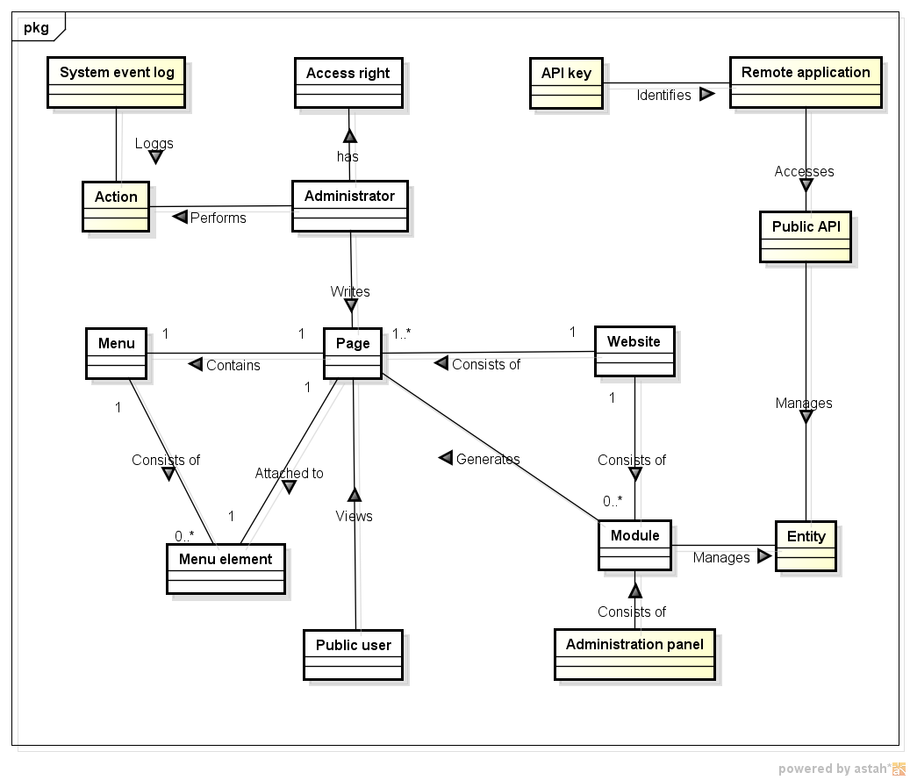


## Application helpers

Below the list of the PepisCMS helpers:

* [dialog_message](./pepiscms/application/helpers/dialog_message_helper.php)
    dialog / UI related functions.
    
    * `display_error($message)`
    * `display_warning($message)`
    * `display_notification($message)`
    * `display_success($message)`
    * `display_tip($message)`
    * `display_breadcrumb($breadcrumb_array, $icon = false)`
    * `display_session_message()` - Renders and prints session flash message.
    * `get_warning_begin()`
    * `get_warning_end()`
    * `display_steps($steps, $type)`
    * `display_steps_circle($steps)`
    * `display_steps_dot($steps)`
    * `display_action_bar($actions)`
    * `button_generic($label, $url, $icon_path, $extra_classes = '', $id = false)`
    * `button_cancel($url = '#', $extra_classes = '', $id = false, $label = false)`
    * `button_back($url = '#', $extra_classes = '', $id = false, $label = false)`
    * `button_next($url = '#', $extra_classes = '', $id = false, $label = false)`
    * `button_previous($url = '#', $extra_classes = '', $id = false, $label = false)`
    * `button_apply($extra_classes = '', $id = false, $label = false)`
    * `button_save($extra_classes = '', $id = false, $label = false)`
    * `dashboard_box($name, $url, $icon_path = false, $description = false, $is_popup = false, $target = false)`
    * `display_confirmation_box($message, $explanation = '')`
    * `display_error_box($message, $explanation = '')`
    
* [email_html](./pepiscms/application/helpers/email_html_helper.php)
    functions that ease building HTML system emails.
    
    * `email_html_open($padding = 20)`
    * `email_html_close()`
    * `email_h1_open()`
    * `email_h1_close()`
    * `email_h2_open()`
    * `email_h2_close()`
    * `email_p_open()`
    * `email_p_close()`
    * `email_a_open($url)`
    * `email_a_close()`
    * `email_html_footer_open($padding=0, $margin_top=40)`
    * `email_html_footer_close()`
    
* [google_maps](./pepiscms/application/helpers/google_maps_helper.php)
    functions for getting coordinates for a given address.
    
    * `google_maps_locate($address)` - Returns an array (lat, lng) representing coordinates of a given address.
    
* [mysqldump](./pepiscms/application/helpers/mysqldump_helper.php)
    functions for creating backups from MYSQL database.
    
    * ` mysqldump($db_host, $database, $db_user, $db_password, $tables = false, $dump_to_filename = false, $dump_structure = true)` - Dumps MySQL database to file.
    
* [os](./pepiscms/application/helpers/os_helper.php)
    functions for detecting Windows systems.
    
    * `is_windows()`
    
* [path](./pepiscms/application/helpers/path_helper.php)
    path helper functions.
    
    * `module_path($module_name = false)`
    
* [popup](./pepiscms/application/helpers/popup_helper.php)
    popup / UI related functions.
    
    * `popup_close_html()` - Returns string used to close popup window.
    
* [youtube](./pepiscms/application/helpers/youtube_helper.php)
    YouTube URL parsing functions.
    
    * `youtube_get_id_by_url($url)` - Extracts YouTube ID from YouTube video URL.

CodeIgniter helpers customization or extension:

* [PEPISCMS_date](./pepiscms/application/helpers/PEPISCMS_date_helper.php)
    extension to CodeIgniter date helper.
    
     * `utc_timestamp()` - Generates a timestamp value compatible with MySQL UTC_TIMESTAMP function.
     
* [PEPISCMS_string](./pepiscms/application/helpers/PEPISCMS_string_helper.php)
    extension to CodeIgniter string helper.
    
    * `niceuri($name)` - Generates a URL friendly string that can be used as URL slug (URL id). Supports Cyrillic as well.
    * `shortname($name, $maxlength = 60, $separator = '...')` - Generates a shortened string, inserts ... in the middle of the shortened value.
    * `remove_separators($str)' - Returns string with all word separators removed (space, dash, minus, plus).
    
* [PEPISCMS_url](./pepiscms/application/helpers/PEPISCMS_url_helper.php)
    extension to CodeIgniter url helper.
    
    * `admin_url($is_absolute = true)` - Returns base URL for admin.
    * `module_url($module_name = false)` - Returns relative admin module base URL. If no module is specified, the currently running module is used.
    * `module_resources_url($module_name = false)` - Returns relative module public resources URL for the specified module. If no module is specified, the currently running module is used.
    * `site_theme_url($theme_name = false)` - Returns relative theme path. If no theme is specified then the system configured theme is used.
    * `module_icon_small_url($module_name = false)` - Returns admin module icon URL. If no module is specified, the currently running module is used.
    * `current_url()` - Returns absolute URL for the current request.
    
* [PEPISCMS_xml](./pepiscms/application/helpers/PEPISCMS_xml_helper.php)
    extension to CodeIgniter xml helper.
    
    * `reflect2xml($object, &$properties_array, $pre_string = '')` - Serializes object properties into XML, used to generate backup.


## Benchmarking

PepisCMS was designed with small memory footprint and processing power in mind.

To enable profiler please change the following property:

```php

// application/config.php

$config['enable_profiler'] = TRUE;
```

You might observe that for concurrent requests access check and menu rendering is skipped.


## Changes comparing to CodeIgniter

| Change                    | Description                                                                                                                                                                                                 |
|---------------------------|-------------------------------------------------------------------------------------------------------------------------------------------------------------------------------------------------------------|
| Modularity                | The system provides a way to break the components of the application in separate independent modules. The core of the project can be upgraded independent of the modules as long as its API is compatible.  |
| Extended Controller       | Modularity support, several types of controllers                                                                                                                                                            |
| Extended Config           | Modularity support                                                                                                                                                                                          |
| Extended Loader           | Added possibility to load themes Modularity support Helper methods like `resolveModuleDirectory()`                                                                                                          |
| Extended Lang             | Integration with the translator hook Added helper method `getCurrentLanguage()` Added support for modularity                                                                                                |
| Extended Output           | Overwritten cache mechanism                                                                                                                                                                                 |
| Extended URI              | Added possibility to shift URI components                                                                                                                                                                   |
| Extended Upload           | Added possibility to accept any file type by setting accepted_file_types to "*" Skipped image size check                                                                                                    |
| Extended Validation       | Added custom validation methods.                                                                                                                                                                            |
| ContainerAware            | Makes it possible to write any library just like if you were writing controller code.                                                                                                                       |


## Enabling library and models autocomplete prediction

Autocomplete and method prediction works out of the box for classes that extend either
[EnhancedController](./pepiscms/application/classes/EnhancedController.php)
(all PepisCMS controller types), [Generic_model](./pepiscms/application/models/Generic_model.php)
and [ContainerAware](./pepiscms/application/classes/ContainerAware.php).

This is obtained by adding `@property` annotations to the above mentioned classes.

### Generating project headers manually

To regenerate libraries and models definition and enable autocomplete predictions for CodeIgniter in PepisCMS you need to:

1. Install [Development tools](#development-tools) module and navigate to the module's dashboard
    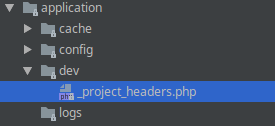

3. Generate *headers* file, the action will generate a definition file located under `application/dev/_project_headers.php`
    
    
4. Mark CodeIgniter Controller.php and Model.php as text (`Right click -> Mark as plaintext`).
    The files paths are `vendor/codeigniter/framework/system/core/Controller.php`
    and `vendor/codeigniter/framework/system/core/Model.php` respectively.
    
5. Benefit from autocomplete predictions and code suggestions :)
    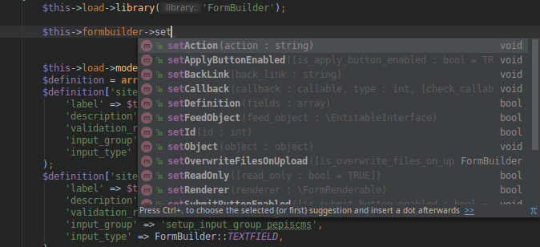


## Optional libraries

### PHPExcel for Excel spreadsheet import/export

PHPSpreadsheet bridge library is not provided by default. To enable support for Excel file import/export please add
the missing dependency. Once the library is present in the classmap, the Excel support capabilities will automatically
be enabled. Excel support can be enabled at any point.

```bash
composer require phpoffice/phpspreadsheet 1.5.*
```

### PHPCas for CAS authentication

PHPCas bridge library is not provided by default. To enable CAS support, please install PHPCas library
**prior to PepisCMS setup configuration**.

```bash
composer require jasig/phpcas 1.3.5
```

### Enabling Symfony bridge

Symfony bridge library is not provided by default. Symfony bridge can be enabled at any point.

```bash
composer require piotrpolak/codeigniter-symfony2-bridge
```