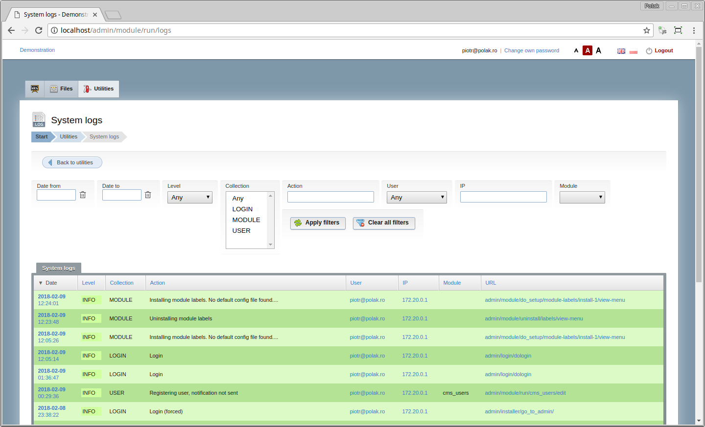

# PepisCMS

[](https://travis-ci.org/piotrpolak/pepiscms)
[](https://codeclimate.com/github/piotrpolak/pepiscms/maintainability)

PepisCMS is a content management system. Its main feature is the [CRUD module generator](docs/GENERATING_A_CRUD_MODULE.md)
which makes it easy to set up an entire administration panel based on the database schema definition within minutes.
The generated administration panel consists of [modules](docs/MODULES.md) that can be customized (or just left as they
are if you don't care about presentation details).

* [Features](docs/FEATURES.md)
* [Demo](#demo)
* [Installation](docs/INSTALLATION.md)
* [Modules](docs/MODULES.md)
* [Generating a CRUD module](docs/GENERATING_A_CRUD_MODULE.md)
* [Security policy](docs/SECURITY_POLICY.md)
* [Deployment configurations](docs/DEPLOYMENT_CONFIGURATIONS.md)
* [Simplified domain model](docs/SIMPLIFIED_DOMAIN_MODEL.md)
* [Architecture overview](docs/ARCHITECTURE_OVERVIEW.md)
* Core libraries:
    * [Generic model](docs/GENERIC_MODEL.md)
    * [FormBuilder](docs/LIBRARY_FORMBUILDER.md)
    * [DataGrid](docs/LIBRARY_DATAGRID.md)
    * [CrudDefinitionBuilder](docs/LIBRARY_CRUD_DEFINITION_BUILDER.md)
    * [ContainerAware](docs/LIBRARY_CONTAINER_AWARE.md)
* [Helpers](docs/HELPERS.md)
* [Breaking API changes and upgrade instructions](CHANGES.md)
* [Benchmarking](docs/BENCHMARKING.md)
* [Naming convention inconsistency](docs/NAMING_CONVENTION_INCONSISTENCY.md)
* [Changes comparing to CodeIgniter](docs/CHANGES_COMPARING_TO_CODEIGNITER.md)
* [Enabling library and models autocomplete predictions](docs/ENABLING_LIBRARY_AND_MODELS_AUTOCOMPLETE_PREDICTION.md)
* [Useful commands](docs/USEFUL_COMMANDS.md)



## Demo

A demo application is automatically deployed to Heroku and can be reached at:

* [https://pepiscms-demo.herokuapp.com/](https://pepiscms-demo.herokuapp.com/)

Please note the demo application contents are automatically cleared up each time a new version is deployed.

## Some history

PepisCMS was started in 2007 as an experimental academic project.
The system is written on top of the [CodeIgniter framework](https://codeigniter.com/) and during its lifespan
it has been fluently ported from CodeIgniter version 1.5.4 to 3.1.* (and counting).

As 2018, the project is **fully functional** (and really fast) but you should be aware that its source code is quite far
away from php latest architectural styles and by some it might be considered a **legacy** (and that would not be
offensive, see its [maintainability score](https://codeclimate.com/github/piotrpolak/pepiscms) at Code Climate).

## Development philosophy

During all those years the project has been developed using a very conservative approach and manually tested on multiple
deployments prior to releasing a stable version. This made it possible to keep regression to minimum but in time of
TDD and automatic builds this approach is obsolete. 

### Becoming open source

On the "10th birthday" the project was released as open source under the [MIT license](LICENSE.txt).

Prior to pushing the project to github its code has been slightly refactored, cleaned up from any proprietary code,
described by some tests and released as a composer dependency.

Being a composer module PepisCMS now benefits from the component management. Upgrading any of its dependencies is now
simplified to incrementing composer versions.

All of the above makes it easy to provide hot fixes and components' updates thus it extends the expected lifespan of the
product.

### Optional libraries

#### PHPExcel for Excel spreadsheet import/export

```bash
composer require phpoffice/phpspreadsheet 1.5.0
```

#### PHPCas for CAS authentication

```bash
composer require jasig/phpcas 1.3.5
```