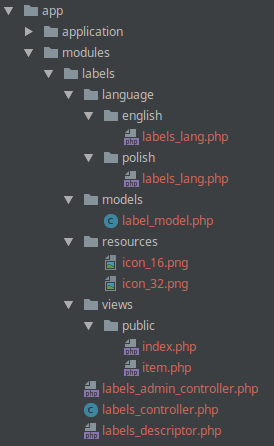

# Modules

There are two types of modules:

* system modules - those modules are bundled within the system and are upgraded when PepisCMS version is upgraded
* user modules - user space modules, those are specific to instance of your application

By default all modules are disabled and must be manually installed (during PepisCMS installation or at any later point).

## Module installation

An SQL code can be executed upon module installation/uninstallation. A file containing SQL code can be optionally
specified in module descriptor.

To view installed modules please navigate to `Start > Utilities > Installed modules`.

## Accessing modules in the browser

### Admin modules

```bash
http://localhost/admin/<modulename>/<action>
```

### Public modules

```bash
http://localhost/<modulename>/<action>
```

Where `<modulename>` is the module name (directory name) and `<action>` is the method name
(the method must have public classifier).

If no action is specified, the default action is `index`, i.e. `http://localhost/<modulename>` is equal to
`http://localhost/<modulename>/index`

Please note that the module must be installed and the `Frontend support (pages and modules)` must be enabled in order
to access public controllers. This can be enabled from `Start > Utilities > Site's configuration`.

## Module structure

* Module descriptor
* Admin controller (optional)
* Public controller (optional)
* Admin views (optional)
* Public views (optional)
* Models (optional)
* Libraries (optional)
* Language files
* Security policy (`security_policy.xml`)
* Additional resources (like default icons: `<module_name>/resources/icon_16.png` and `<module_name>/resources/icon_32.png`)

## Below the structure of sample `labels` module:



## Built-in modules

### Groups

An utility for managing user groups and groups access rights.


### User accounts

An utility for managing and registering new users.


### Development tools


### System logs

All user actions and unexpected application behaviors can be tracked using an advanced log utility.

PepisCMS provides a logging API and a console for analyzing system logs.

Every single log consists of the following entry:
* **Timestamp** of the event
* **User ID/email** generating the event
* **IP address** of the user creating the entry
* **Modul ename** (if case)
* **Collection name** – abstract label used for grouping the events and drawing statistics
* **Debug message**
* **URL** where the event occurred
* **Severity** of the event –info, notice, warning, error


### SQL console


### System information

Display system information, paths, versions, storage occupied.


### Translator

An utility for translating user interface.


### Symfony2 bridge

Allows to invalidate Symfony cache and to view Symfony logs.

### Backup

Allows to export/import pages structure to/from XML.

Pages feature must be enabled to use this module.

### CRUD

This module is a base for any other CRUD module. It is not installable.

### Dmesg

Displays system dmesg.

### HTML customization for admin panel

Allows to inject HTML snippets to admin panel header and footer.

### Remote applications

Allows to manage remote applications and their keys.

### XML-RPC consumer demo

XML-RPC consuler demo. Calls services exposed by `XML-RPC service` module.

### XML-RPC service

Exposes some sample remote methods.